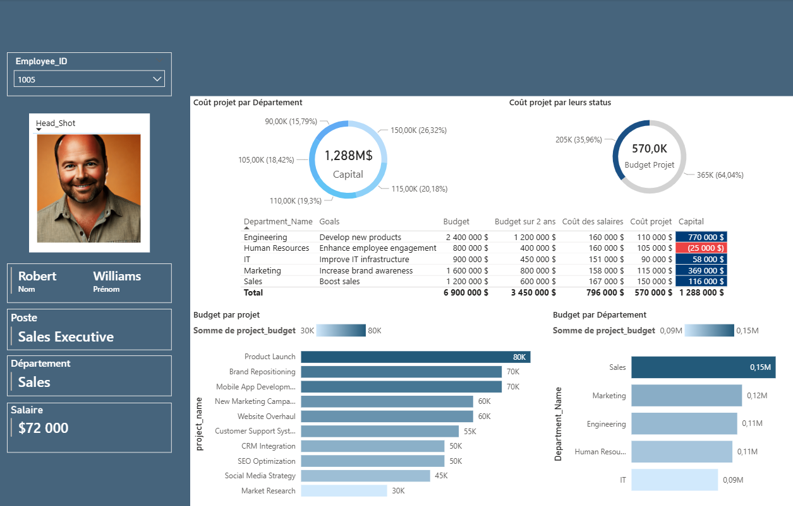

# 📊 Analyse de Données End-to-End avec SQL & Power BI

Ce projet présente une **analyse complète de données** : de l’extraction SQL jusqu’à la visualisation dynamique dans Power BI. Il met en valeur les compétences en **business intelligence**, **nettoyage des données**, **KPIs commerciaux**, et **dataviz**.

🔗 **Dépôt GitHub** : [Project-analysis-end-to-end-SQL-and-Power-BI](https://github.com/JWulfran/Project-analysis-end-to-end-SQL-and-Power-BI.git)

---

## 🎯 Objectifs du projet

- Explorer et nettoyer les données brutes avec SQL
- Créer des KPIs clés liés à la performance commerciale
- Construire un **dashboard Power BI interactif** pour la prise de décision
- Automatiser les étapes de préparation et d’analyse

---

## 🧰 Outils & technologies

- **SQL** (requêtes complexes, jointures, agrégations)
- **Power BI Desktop** (Power Query, DAX, visualisations interactives)

---

## 📈 Étapes du projet

1. **Exploration et extraction**

   - Nettoyage des données clients, ventes, produits
   - Requêtes SQL pour consolider les sources

2. **Préparation dans Power BI**

   - Importation via Power Query
   - Modélisation des relations (schéma en étoile)
   - Création de colonnes & mesures DAX

3. **Construction du dashboard**

   - KPIs : chiffre d’affaires, nombre de clients, panier moyen, etc.
   - Visualisations : barres, cartes, tables dynamiques, segments

4. **Analyse & interprétation**
   - Recommandations pour la stratégie commerciale
   - Détection de produits et clients à forte valeur

---

## 📊 Aperçu du dashboard

---

## 🧠 Ce que j’ai appris

- Conduire une analyse complète **data-driven** avec SQL et Power BI
- Créer des tableaux de bord professionnels et lisibles
- Automatiser l’analyse via Power Query et DAX
- Traduire des données brutes en **insights actionnables**

---

📂 _Ce projet illustre mon expertise en analyse commerciale, traitement SQL, et visualisation avec Power BI. Il peut s’appliquer à des contextes réels d’entreprise pour améliorer la prise de décision._
